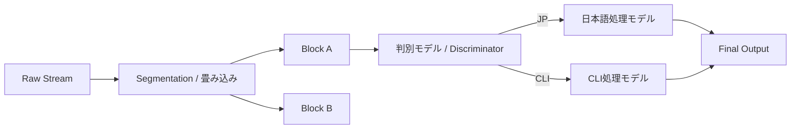

# Dual Model Architecture (判別と処理の分離)

SmartIMEは、入力を「畳み込み（ブロック化）」し、それぞれの断片に対して最適なモデルを割り当てる **Discriminator-Processor (判別・処理) アーキテクチャ** を採用します。

## 1. コンセプト: ブロック分割とルーティング
長い入力文字列を単一の塊として扱うのではなく、意味の「分かれ目」でブロック（セグメント）に切り分けます。

## 2. 判別モデル (Intent Discriminator)
「これは何か？」を特定する軽量・高速な確率モデルです。
- **役割**: 入力ブロックに対して属性ラベル（JP / CLI / EN / Unknown）と確信度を付与する。
- **特徴**: 文字の並び順（N-gram）や記号密度を瞬時に評価し、次の「処理モデル」へとルーティングする。

## 3. 処理モデル (Intent Processor)
「判別された結果をどう変換するか？」に特化した専門モデルです。
- **日本語処理モデル (JP Processor)**: かなへの復元、形態素解析、漢字変換、誤字補完（脱字のやさしい理解）を担当。
- **CLI処理モデル (CLI Processor)**: 原文保持、コマンド補完、パスの正規化を担当。
- **英語処理モデル (EN Processor)**: スペルチェッカー、辞書提案を担当。

## 4. 畳み込みとセグメンテーション (Segmentation)
混合入力（例: `git commit -m "修正"`）において、どこでモデルを切り替えるかの判断基準です。
- **Boundary Detection**: 記号（引用符、スペース、ハイフン）や「日本語らしさスコア」の急激な変化点を「分かれ目」として検知します。
- **Overlapping Context**: ブロックの端では前後の文脈（ブロック）を参照し、境界での誤判定を防ぎます。

## 5. この設計のメリット
- **専門化**: 判別モデルは軽く、処理モデルは重厚に（あるいは目的に最適化）することができ、全体のレイテンシを抑制できる。
- **拡張性**: 新しい「計算専門モデル（例: 数式処理など）」を追加する際、判別モデルに新しいラベルを追加するだけで対応可能。
- **段階的実装**: まずは「判別」だけを実装し、処理は「原文ママ」から始めるなど、開発のフェーズ分けが容易になる。
